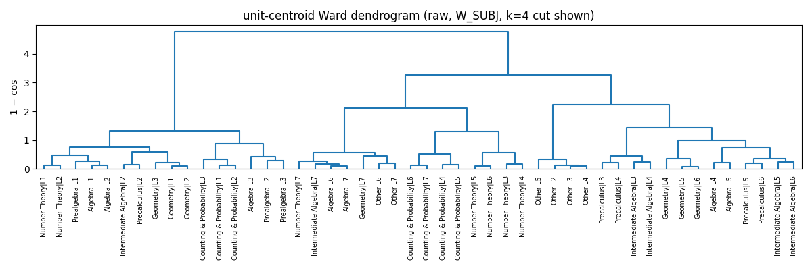
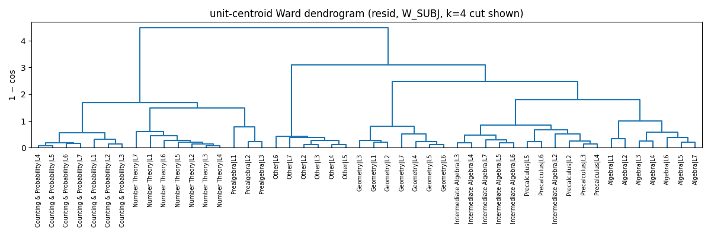
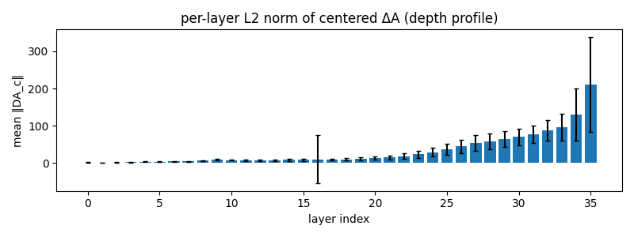

# unit-centroid 클러스터 도출/검증 — 2026-06-22 (tag=clusterderive)

> **metric pipeline 검증.** `DAT → DA_c = DAT − μ_pooled(per-layer,per-feature)` → `DAn = per-sample per-layer L2-normalize` (sa.normalize_members) → window 평균 후 dot-product = cosine. cos 음수는 정보 → **클립 금지**, Ward(1−cos) 만 numerical noise 방어용 max(0,·).

**데이터.** pooled(pilot1+pilot2) THINKING ΔA, N=3025 (raw 3025, non-finite drop 0). subjects=8 levels=[1, 2, 3, 4, 5, 6, 7, 8] units(all)=58 units(keep n≥30)=48.
- units(drop n<30, n=10): Counting & Probability|L8(n=10), Geometry|L8(n=9), Intermediate Algebra|L1(n=16), Intermediate Algebra|L8(n=11), Number Theory|L8(n=23), Other|L1(n=24), Other|L8(n=13), Prealgebra|L4(n=17), Precalculus|L1(n=18), Precalculus|L7(n=27)

**windows.** W_SUBJ=[9, 10, 11, 12, 14], W_LEV=[20, 25, 26, 27, 29, 30, 31], W_ALL=range(36).

## §1. cross-level binding (cluster ≠ level 직접검정)

unit-centroid(layer 평균 후 L2-norm) cosine 위에서, off-diagonal 쌍을 분류:
- **A** = same-subject / diff-level  (subject가 level을 가로질러 묶이는가)
- **B** = diff-subject / same-level  (level이 subject를 가로질러 묶이는가)
- A>B → level penalty 를 이긴 강한 cluster≠level 증거.
- A 는 |Δlevel|∈{1,2,≥3} 으로 분해해 long-range subject binding 검사.

| window | A mean (same-subj/diff-lev) | B mean (diff-subj/same-lev) | Δ=A−B | Cohen's d | nA | nB | C (same/same) | D (diff/diff) | perm p* |
|---|---|---|---|---|---|---|---|---|---|
| Wall | +0.2854 | +0.4998 | -0.2143 | -0.546 | 127 | 144 | +nan(n=0) | -0.0208(n=857) | 0.0010 |
| Wsubj | +0.3439 | +0.3457 | -0.0018 | -0.004 | 127 | 144 | +nan(n=0) | -0.0903(n=857) | 0.0010 |
| Wlev | +0.2382 | +0.5774 | -0.3393 | -0.813 | 127 | 144 | +nan(n=0) | -0.0135(n=857) | 0.0010 |

\* perm p = subject 라벨을 unit-centroid 행에 셔플한 exploratory null. 결정은 effect size(Δ, Cohen's d)에 의함.

**A 의 level-gap 분해 (same-subject 결합이 먼 level까지 살아남는가)**

| window | A |Δlev|=1 | A |Δlev|=2 | A |Δlev|≥3 |
|---|---|---|---|
| Wall | +0.7809(n=40) | +0.4729(n=32) | -0.1840(n=55) |
| Wsubj | +0.7851(n=40) | +0.5116(n=32) | -0.0746(n=55) |
| Wlev | +0.7909(n=40) | +0.4401(n=32) | -0.2813(n=55) |

## §2. unit-centroid Ward 클러스터 (W_SUBJ)

거리 = 1 − cos. **cos 음수 클립 절대 없음** (정보 보존).
silhouette 라벨 후보 = {cluster, subject, level} (unit 자체는 self-라벨이라 무의미).

### §2.raw.k=3  silhouette(cluster)=+0.349  silhouette(subject)=+0.048  silhouette(level)=-0.051

**cluster × level**

| cluster\level | 1 | 2 | 3 | 4 | 5 | 6 | 7 | sum |
|---|---|---|---|---|---|---|---|---|
| 1 | 5 | 7 | 4 | 0 | 0 | 0 | 0 | 16 |
| 2 | 0 | 0 | 1 | 2 | 2 | 4 | 6 | 15 |
| 3 | 0 | 1 | 3 | 5 | 5 | 3 | 0 | 17 |
| **sum** | 5 | 8 | 8 | 7 | 7 | 7 | 6 | 48 |

**cluster × subject** (unit 수)

| cluster\subject | Algebra | Counting & Probability | Geometry | Intermediate Algebra | Number Theory | Other | Prealgebra | Precalculus | sum |
|---|---|---|---|---|---|---|---|---|---|
| 1 | 3 | 3 | 3 | 1 | 2 | 0 | 3 | 1 | 16 |
| 2 | 2 | 4 | 1 | 1 | 5 | 2 | 0 | 0 | 15 |
| 3 | 2 | 0 | 3 | 4 | 0 | 4 | 0 | 4 | 17 |
| **sum** | 7 | 7 | 7 | 6 | 7 | 6 | 3 | 5 | 48 |

### §2.raw.k=4  silhouette(cluster)=+0.381  silhouette(subject)=+0.048  silhouette(level)=-0.051

**cluster × level**

| cluster\level | 1 | 2 | 3 | 4 | 5 | 6 | 7 | sum |
|---|---|---|---|---|---|---|---|---|
| 1 | 5 | 7 | 4 | 0 | 0 | 0 | 0 | 16 |
| 2 | 0 | 0 | 1 | 2 | 2 | 4 | 6 | 15 |
| 3 | 0 | 1 | 1 | 1 | 1 | 0 | 0 | 4 |
| 4 | 0 | 0 | 2 | 4 | 4 | 3 | 0 | 13 |
| **sum** | 5 | 8 | 8 | 7 | 7 | 7 | 6 | 48 |

**cluster × subject** (unit 수)

| cluster\subject | Algebra | Counting & Probability | Geometry | Intermediate Algebra | Number Theory | Other | Prealgebra | Precalculus | sum |
|---|---|---|---|---|---|---|---|---|---|
| 1 | 3 | 3 | 3 | 1 | 2 | 0 | 3 | 1 | 16 |
| 2 | 2 | 4 | 1 | 1 | 5 | 2 | 0 | 0 | 15 |
| 3 | 0 | 0 | 0 | 0 | 0 | 4 | 0 | 0 | 4 |
| 4 | 2 | 0 | 3 | 4 | 0 | 0 | 0 | 4 | 13 |
| **sum** | 7 | 7 | 7 | 6 | 7 | 6 | 3 | 5 | 48 |

### §2.raw.k=5  silhouette(cluster)=+0.367  silhouette(subject)=+0.048  silhouette(level)=-0.051

**cluster × level**

| cluster\level | 1 | 2 | 3 | 4 | 5 | 6 | 7 | sum |
|---|---|---|---|---|---|---|---|---|
| 1 | 5 | 7 | 4 | 0 | 0 | 0 | 0 | 16 |
| 2 | 0 | 0 | 0 | 0 | 0 | 2 | 5 | 7 |
| 3 | 0 | 0 | 1 | 2 | 2 | 2 | 1 | 8 |
| 4 | 0 | 1 | 1 | 1 | 1 | 0 | 0 | 4 |
| 5 | 0 | 0 | 2 | 4 | 4 | 3 | 0 | 13 |
| **sum** | 5 | 8 | 8 | 7 | 7 | 7 | 6 | 48 |

**cluster × subject** (unit 수)

| cluster\subject | Algebra | Counting & Probability | Geometry | Intermediate Algebra | Number Theory | Other | Prealgebra | Precalculus | sum |
|---|---|---|---|---|---|---|---|---|---|
| 1 | 3 | 3 | 3 | 1 | 2 | 0 | 3 | 1 | 16 |
| 2 | 2 | 0 | 1 | 1 | 1 | 2 | 0 | 0 | 7 |
| 3 | 0 | 4 | 0 | 0 | 4 | 0 | 0 | 0 | 8 |
| 4 | 0 | 0 | 0 | 0 | 0 | 4 | 0 | 0 | 4 |
| 5 | 2 | 0 | 3 | 4 | 0 | 0 | 0 | 4 | 13 |
| **sum** | 7 | 7 | 7 | 6 | 7 | 6 | 3 | 5 | 48 |

### §2.resid.k=3  silhouette(cluster)=+0.381  silhouette(subject)=+0.432  silhouette(level)=-0.183

**cluster × level**

| cluster\level | 1 | 2 | 3 | 4 | 5 | 6 | 7 | sum |
|---|---|---|---|---|---|---|---|---|
| 1 | 3 | 3 | 3 | 2 | 2 | 2 | 2 | 17 |
| 2 | 0 | 1 | 1 | 1 | 1 | 1 | 1 | 6 |
| 3 | 2 | 4 | 4 | 4 | 4 | 4 | 3 | 25 |
| **sum** | 5 | 8 | 8 | 7 | 7 | 7 | 6 | 48 |

**cluster × subject** (unit 수)

| cluster\subject | Algebra | Counting & Probability | Geometry | Intermediate Algebra | Number Theory | Other | Prealgebra | Precalculus | sum |
|---|---|---|---|---|---|---|---|---|---|
| 1 | 0 | 7 | 0 | 0 | 7 | 0 | 3 | 0 | 17 |
| 2 | 0 | 0 | 0 | 0 | 0 | 6 | 0 | 0 | 6 |
| 3 | 7 | 0 | 7 | 6 | 0 | 0 | 0 | 5 | 25 |
| **sum** | 7 | 7 | 7 | 6 | 7 | 6 | 3 | 5 | 48 |

### §2.resid.k=4  silhouette(cluster)=+0.431  silhouette(subject)=+0.432  silhouette(level)=-0.183

**cluster × level**

| cluster\level | 1 | 2 | 3 | 4 | 5 | 6 | 7 | sum |
|---|---|---|---|---|---|---|---|---|
| 1 | 3 | 3 | 3 | 2 | 2 | 2 | 2 | 17 |
| 2 | 0 | 1 | 1 | 1 | 1 | 1 | 1 | 6 |
| 3 | 1 | 1 | 1 | 1 | 1 | 1 | 1 | 7 |
| 4 | 1 | 3 | 3 | 3 | 3 | 3 | 2 | 18 |
| **sum** | 5 | 8 | 8 | 7 | 7 | 7 | 6 | 48 |

**cluster × subject** (unit 수)

| cluster\subject | Algebra | Counting & Probability | Geometry | Intermediate Algebra | Number Theory | Other | Prealgebra | Precalculus | sum |
|---|---|---|---|---|---|---|---|---|---|
| 1 | 0 | 7 | 0 | 0 | 7 | 0 | 3 | 0 | 17 |
| 2 | 0 | 0 | 0 | 0 | 0 | 6 | 0 | 0 | 6 |
| 3 | 0 | 0 | 7 | 0 | 0 | 0 | 0 | 0 | 7 |
| 4 | 7 | 0 | 0 | 6 | 0 | 0 | 0 | 5 | 18 |
| **sum** | 7 | 7 | 7 | 6 | 7 | 6 | 3 | 5 | 48 |

### §2.resid.k=5  silhouette(cluster)=+0.410  silhouette(subject)=+0.432  silhouette(level)=-0.183

**cluster × level**

| cluster\level | 1 | 2 | 3 | 4 | 5 | 6 | 7 | sum |
|---|---|---|---|---|---|---|---|---|
| 1 | 3 | 3 | 3 | 2 | 2 | 2 | 2 | 17 |
| 2 | 0 | 1 | 1 | 1 | 1 | 1 | 1 | 6 |
| 3 | 1 | 1 | 1 | 1 | 1 | 1 | 1 | 7 |
| 4 | 0 | 2 | 2 | 2 | 2 | 2 | 1 | 11 |
| 5 | 1 | 1 | 1 | 1 | 1 | 1 | 1 | 7 |
| **sum** | 5 | 8 | 8 | 7 | 7 | 7 | 6 | 48 |

**cluster × subject** (unit 수)

| cluster\subject | Algebra | Counting & Probability | Geometry | Intermediate Algebra | Number Theory | Other | Prealgebra | Precalculus | sum |
|---|---|---|---|---|---|---|---|---|---|
| 1 | 0 | 7 | 0 | 0 | 7 | 0 | 3 | 0 | 17 |
| 2 | 0 | 0 | 0 | 0 | 0 | 6 | 0 | 0 | 6 |
| 3 | 0 | 0 | 7 | 0 | 0 | 0 | 0 | 0 | 7 |
| 4 | 0 | 0 | 0 | 6 | 0 | 0 | 0 | 5 | 11 |
| 5 | 7 | 0 | 0 | 0 | 0 | 0 | 0 | 0 | 7 |
| **sum** | 7 | 7 | 7 | 6 | 7 | 6 | 3 | 5 | 48 |

### §2.ARI 안정성 (raw, W_SUBJ)

- pilot1·pilot2 각각에서 n≥30 인 unit 의 **교집합** = 47 units (전체 keep 48 중).

| k | ARI(pilot1 vs pilot2, raw) | ARI(raw vs residual, full keep ∩ common) |
|---|---|---|
| 3 | +0.644 | +0.157 |
| 4 | +0.605 | +0.210 |
| 5 | +0.458 | +0.256 |

## §3. ‖ΔA‖ depth profile + length redundancy

normalize 이전(centered) 의 magnitude 분포가 깊은 레이어에서 큰지, 그리고 그 z-score 가 gen_len 으로 얼마나 설명되는지.

- per-layer mean ‖DA_c‖ (depth profile, L0..L35):

| layer | mean ‖DA_c‖ |
|---|---|
| L0 | 1.071 |
| L1 | 0.809 |
| L2 | 0.922 |
| L3 | 1.592 |
| L4 | 3.130 |
| L5 | 3.089 |
| L6 | 3.625 |
| L7 | 4.005 |
| L8 | 5.899 |
| L9 | 8.432 |
| L10 | 7.509 |
| L11 | 7.103 |
| L12 | 6.967 |
| L13 | 7.561 |
| L14 | 7.876 |
| L15 | 7.900 |
| L16 | 9.804 |
| L17 | 8.759 |
| L18 | 9.262 |
| L19 | 11.232 |
| L20 | 12.710 |
| L21 | 14.510 |
| L22 | 17.838 |
| L23 | 22.725 |
| L24 | 28.240 |
| L25 | 35.783 |
| L26 | 44.258 |
| L27 | 53.929 |
| L28 | 58.021 |
| L29 | 63.881 |
| L30 | 70.041 |
| L31 | 77.344 |
| L32 | 86.984 |
| L33 | 96.391 |
| L34 | 129.688 |
| L35 | 210.935 |

- ρ(z, level)               = **+0.050**
- ρ(z, gen_len)             = **+0.221**
- partial ρ(z, level|gen_len)= **-0.155**
- η²(subject) on z          = **0.0220** (1-D, 불균형 근사)

## 결론 박스 (수치-only)

- **§1 Wall**: Δ=A−B=-0.2143, Cohen's d=-0.546 (A 분해: gap1=+0.781, gap2=+0.473, gap≥3=-0.184). Δ>0 & 먼 gap에서도 양수 유지 → cluster≠level.
- **§2 raw k=4**: sil(cluster)=+0.381, sil(subject)=+0.048, sil(level)=-0.051. subject > level 이면 unit이 subject 로 더 뭉친 것.
- **§2 ARI k=4**: pilot1↔pilot2=+0.605, raw↔resid=+0.210.
- **§3**: ρ(z,gen_len)=+0.221 (∼0.74면 redundant), partial ρ(z,level|gen_len)=-0.155 (length-controlled 난이도 신호 잔존 여부).

---
elapsed = 42s
